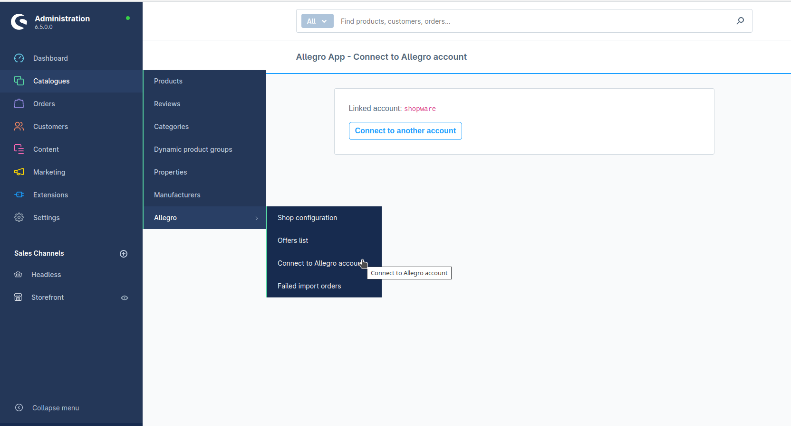
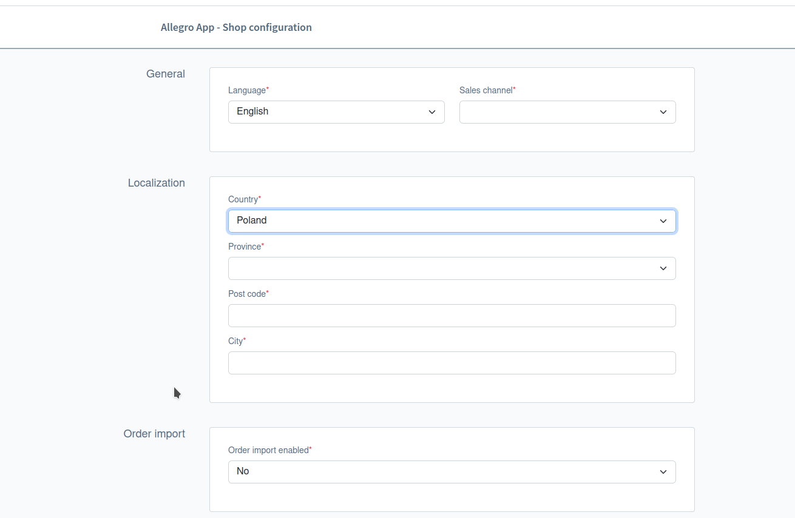
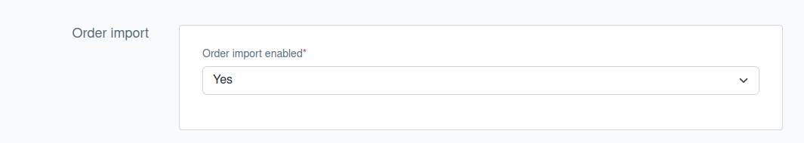
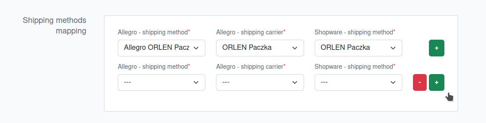
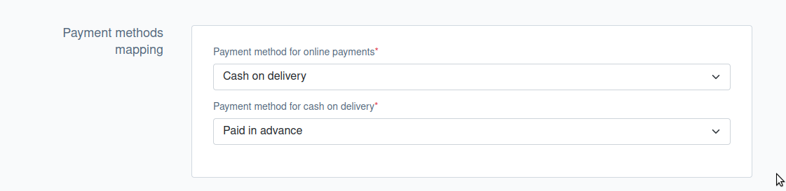
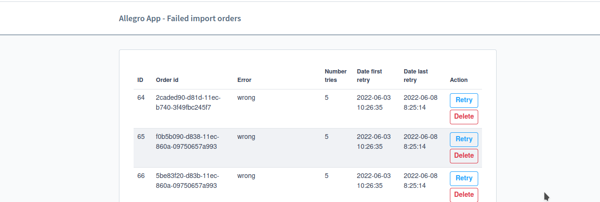
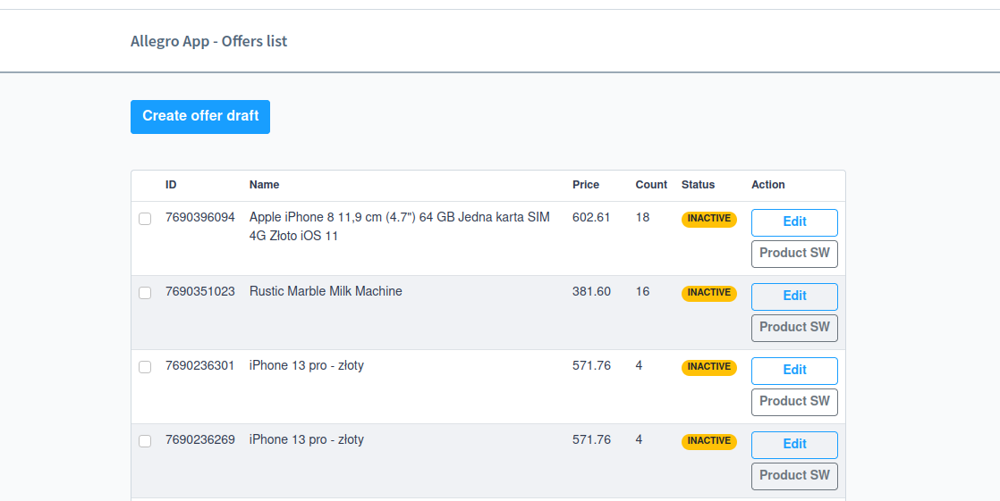
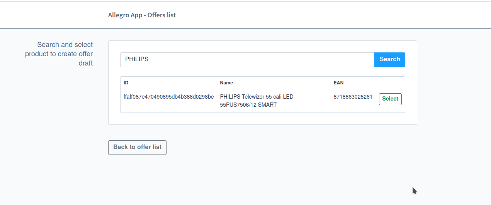
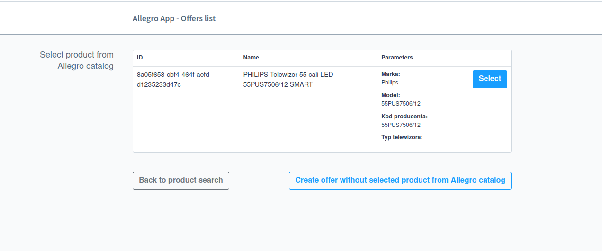
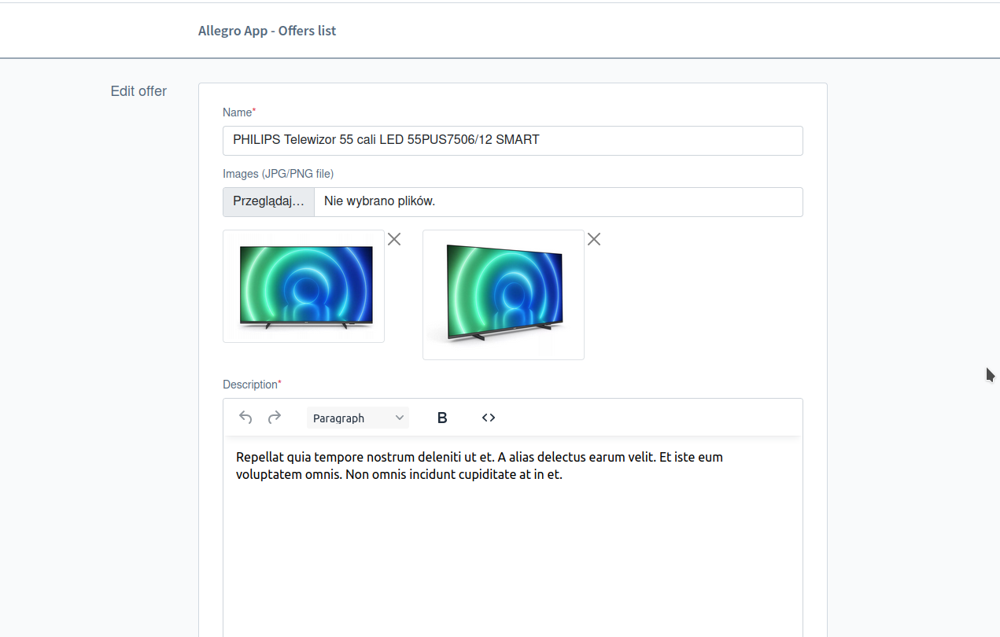

# Shopware - Allegro APP

https://store.shopware.com/en/alleg65938251567f/shopware-allegro.html

## Features

---

- Two-way order handling:
    - Import orders from Allegro to Shopware.
    - Change statuses in progress (shipping status).
    - Issuing tracking numbers in Shopware and sending to Allegro.
- Offer management:
    - Creating an offer based on a product in Shopware.
    - Editing the offer from the Shopware level.
    - Offer status management.

## Installation

---

After installing the application you should:
- Create a sales channel called "Allegro" in Shopware.
- Add payment methods "Allegro Online" and "Allegro cash on delivery" or use existing methods
- Connect the application with the Allegro account.
- Complete application configurations.
- Assign EAN numbers to products in Shopware (to connect the product to the Allegro Product Catalog)
- Associate products in Shopware with existing offers (optional).

## Creating a sales channel in Shopware

---

To separate orders from frontend / headless and Allegro, an additional sales channel should be created in Shopware.
The sales channel should not be public, so we don't add the domain.

### Important!!!

- You should set the currency of the sales channel to PLN (Złoty) because Allegro does not support any other currency.
- Set the default delivery method - this will be used to create Shopware orders in case the mapping of delivery methods is not completed correctly.

## Set up payment methods

---

It is recommended to add new payment methods "Allegro online" and "Allegro cash on delivery" in Shopware so that they do not affect the currently existing payment methods and integrations with payment providers.

## Connect to the Allegro account

---

To connect the applications with the Allegro account, you need to:
- Go to Catalogues -> Allegro - Connect to Allegro account.
- Click the Connect button, which will redirect you to the Allegro website, where you must log in to your account and give consent to connect to the application.

## Application configuration

---

Should do:
- Specify the application language.
- Complete the location data (needed to list offers).
- Specify whether order import should be enabled.
- Specify the sales channel to which orders should be sent (required for active import of orders).
- Add payment methods mapping (required for active order import).
- Add delivery method mapping (required for active order import).

## Two-way order processing

---

After connecting the application with Allegro, we can enable the import of orders in the configuration.

You should also add the mapping of payment and delivery methods from Shopware to the appropriate Allegro methods.

For mapping delivery methods, we have a dynamic list to which we can add further items, in which we choose one of the delivery methods available in Allegro, the carrier and the delivery method available and active in the Shopware store configuration.

For mapping payment methods, we have two drop-down lists, in which we can choose one of the payment methods available and active in the Shopware store configuration - for incoming orders from Allegro with online payment and for orders with cash on delivery.

After completing the API configuration, Allegro will be asked every 5 minutes about order events. As part of this query, all paid orders will be imported into Shopware.

If for some reason the order fails to be imported, the information about the failure is saved and can be viewed by entering *Allegro App - Failed import orders*.

There is information about the reason for the error, the number of import attempts, the date of the first and last import attempt, and the order ID. Import of such orders will be repeated every 5 hours. You can also delete or import them manually.

### Stock levels

If the "Clearance sale" option is enabled for a product that is listed as an offer in Allegro, stock levels are checked - if the product is out of stock or the quantity is too small, the order is not imported and goes to the incorrect order log with information about which product from the given order has too little stock. After completing the information about the stock of products, you can import the order again from the table of incorrect orders.

### Order statusing

The status change in Allegro takes place twice - when downloading the order to Shopware (change in Allegro to "PROCESSING") and in the case of changing the delivery status in Shopware to "Shipped" (change in Allegro to "SHIPPED"). Below is a table describing how to change order statuses in Shopware.

| Action                                                                                             | Allegro status | Order status | Payment status                    | Delivery status |
|----------------------------------------------------------------------------------------------------|----------------|--------------|-----------------------------------|-----------------|
| Create an order in Shopware                                                                        | PROCESSING     | In progress  | Paid (online) or Cash on Delivery | Open            |
| Issuing a shipment in Shopware (adding a tracking code) - changing the shipping status to "Shipped"| SENT           | In progress  | Paid (online) or Cash on Delivery | Shipped         | 

### Sending information about tracking numbers

In Shopware and Allegro, you can add several tracking numbers per order. To add tracking numbers, edit the order and complete the numbers in the "Track and trace codes" field, and then save the order.

#### IMPORTANT!!!
In order to correctly send tracking numbers to Allegro, you must first assign tracking numbers to the order, and then change the delivery status to "Shipped".

## Offer management

--- 

From the application level, we can list Shopware products on Allegro. To do this, you must:
- Create a delivery price list on your Allegro account.
- Add information about returns, complaints and guarantees on Allegro (required only for a company account).
- Complete the location information in the configuration.
- Add EAN to products in Shopware.

After meeting the above requirements, you can start listing offers from the application level. Go to *Allegro App - Offers list* and click *Create offer draft*.

Then we search and select a product from Shopware on the basis of which the offer will be created.

Next we select a product from the Allegro catalog. The products to choose from will be selected based on the EAN of the product from Shopware.

The last step is to complete the required parameters in the form and save the offer.

### Assigning products in shopware to existing offers

If we have an offer that is not assigned to the shopware product (it was created outside the application).

To assign a product in shopware to an existing offer:
- Access the administration panel of the shopware store
- Open the product list and select a product
- Go to the Specifications tab and scroll down to the Custom fields section
- Then go to the Allegro tab and complete the offer ID field (offer id from the list of offers)

## Contact

---

If you want to contact us, the best way is send e-mail to shopware-allegro@macopedia.com with your question(s). We guarantee that we answer as soon as we can!

## License

---

This app is completely free and released under the terms of the MIT license.
